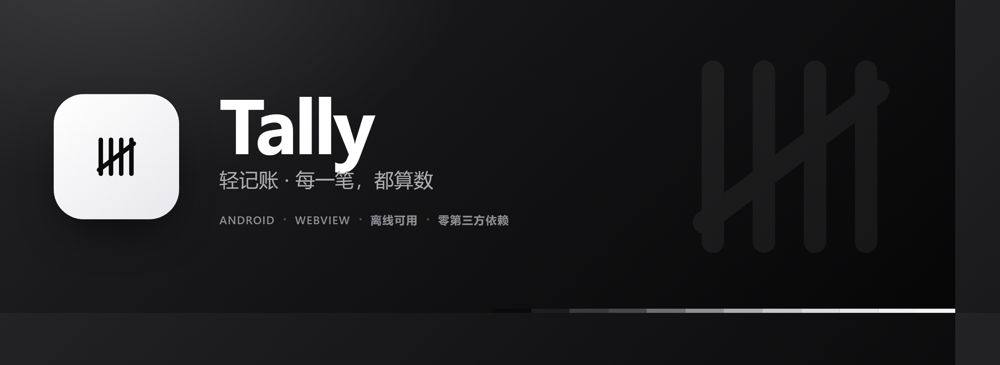
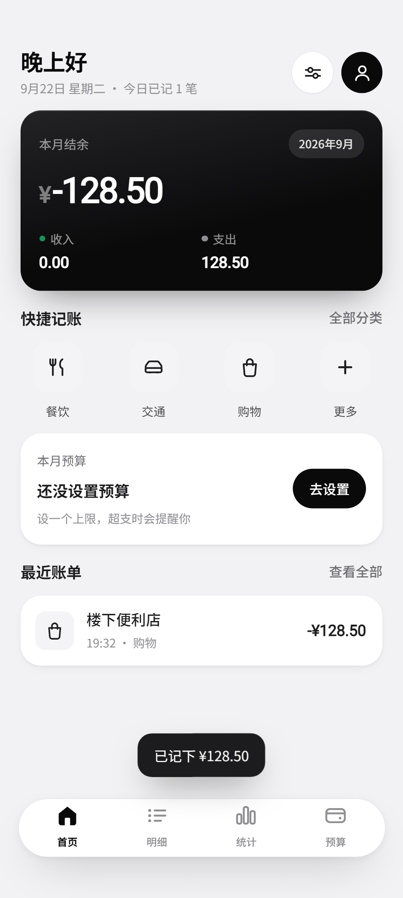
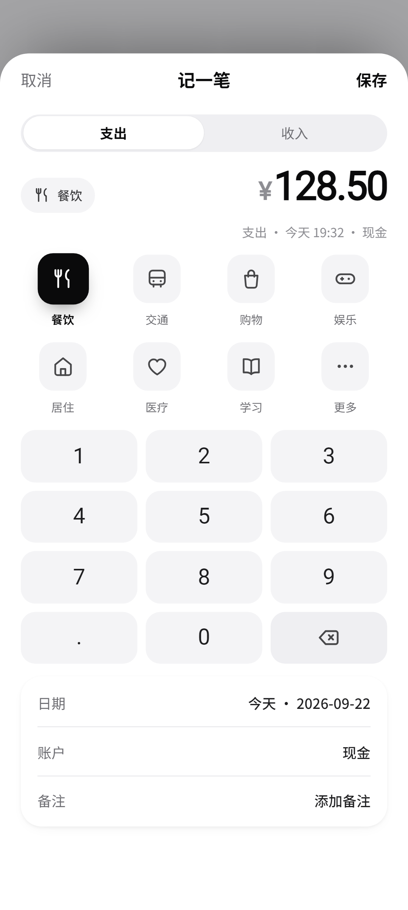
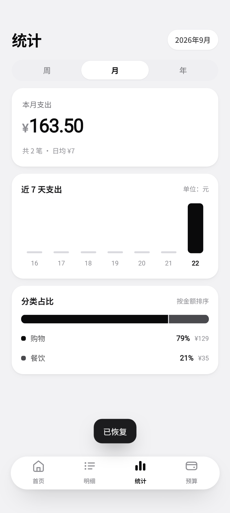
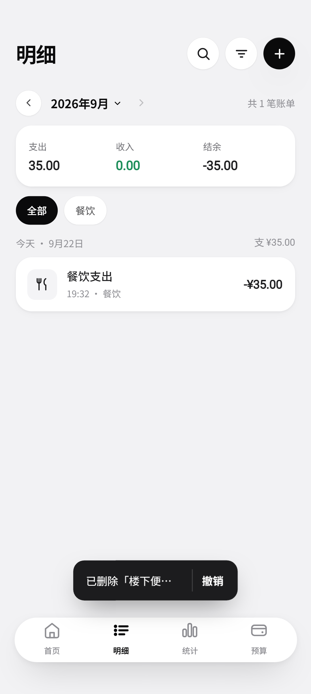
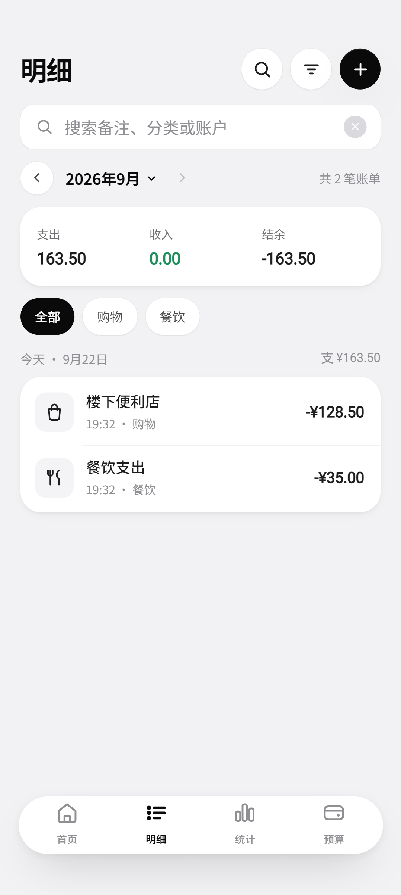
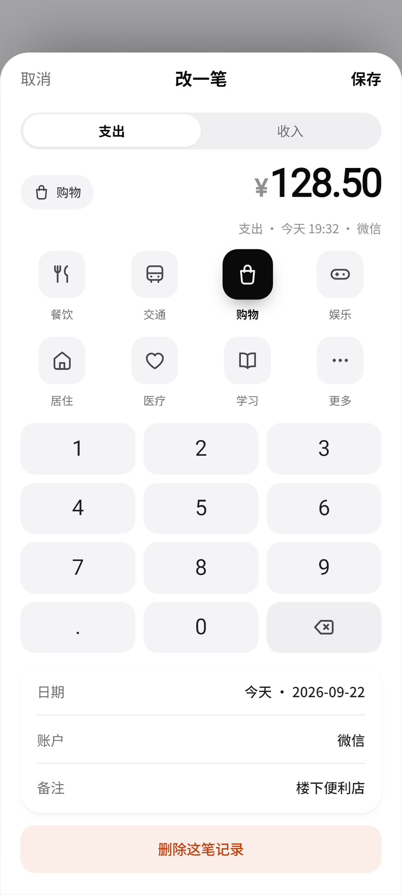
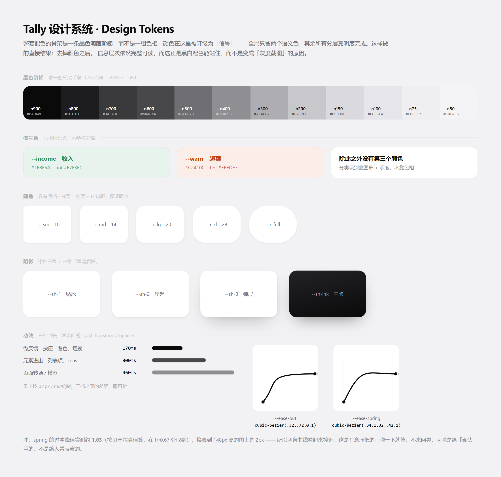
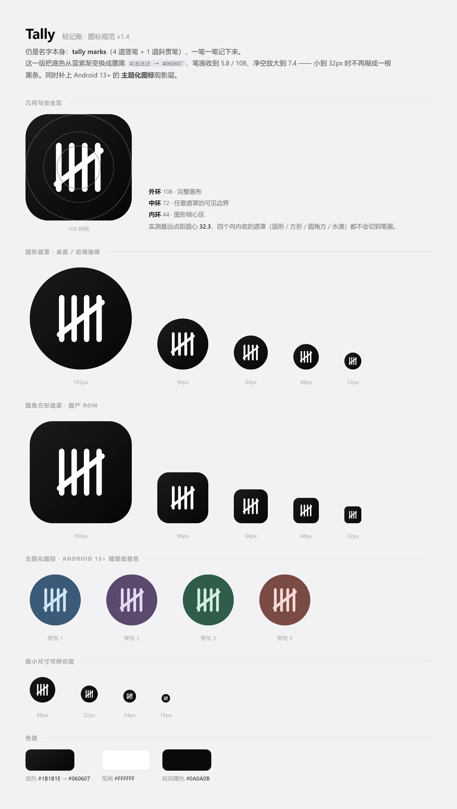
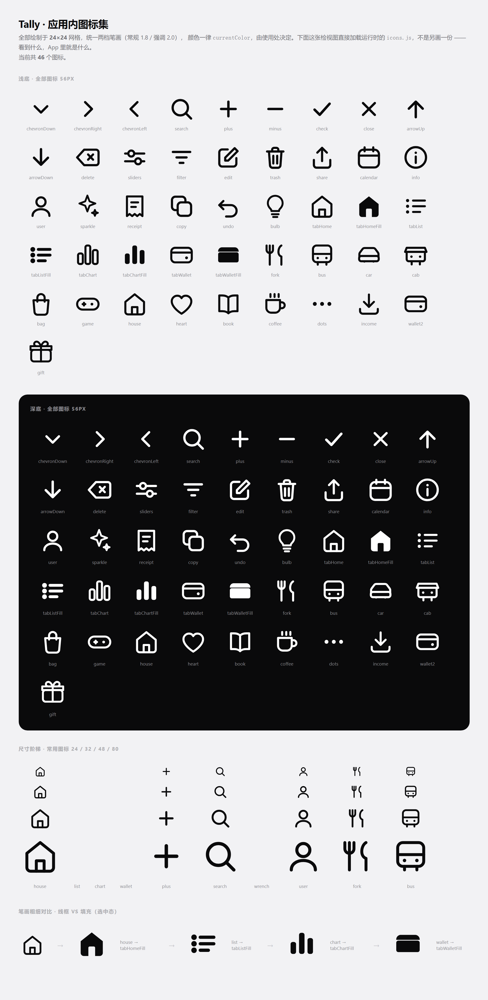

<div align="center">
  
</div>

<div align="center">

**Tally**（轻记账）是一个 Android 本地记账应用。界面全部由 Web 层绘制，原生只补齐 WebView 做不到的那几件事。

[](https://github.com/tyabase/tally-android/actions/workflows/build.yml)
[](LICENSE)
[](https://github.com/tyabase/tally-android/releases)
[](#构建)
[](#构建)
[](#隐私)

**完全离线 · 零权限 · 零第三方依赖 · 无广告无账号**

</div>

---

## 目录

- [这个项目的起点](#这个项目的起点)
- [截图](#截图)
- [功能](#功能)
- [设计系统：把颜色降级为信号](#设计系统把颜色降级为信号)
- [动效体系](#动效体系)
- [图标](#图标)
- [架构](#架构)
- [三个从架构层面解决的坑](#三个从架构层面解决的坑)
- [构建](#构建)
- [怎么验证它真的没坏](#怎么验证它真的没坏)
- [目录结构](#目录结构)
- [已知取舍](#已知取舍)
- [隐私](#隐私)
- [License](#license)

---

## 这个项目的起点

起点是一个设计问题，不是功能问题：**为什么记账 App 大多看起来不像一件被认真设计过的东西？**

拿自己做自我批评，上一版的病灶很清楚：

| 症状 | 病根 |
|---|---|
| 蓝紫渐变主卡 + 满屏分类色相 | 颜色在**装饰**，而不是在**传达信息** |
| 所有状态切换都是瞬变 | 没有一处过渡，所以再调色板也不会有「高级感」 |
| 分类靠色块区分 | 色弱用户在深色环境下完全无法识别 |
| 图标 22 格 / 24 格混用、笔画三档 | 一排图标看着不齐，但说不清哪不齐 |
| 弹层用 `z-index` 抢层级 | 「弹层被盖住」这类 bug 永远修不干净 |

v1.4 逐个处理了它们，其中最根本的一条是：**把颜色从「装饰」降级为「信号」**。

全局只留两个语义色（收入、超额），其余所有分层靠**墨色明度阶梯**完成。这不是「把蓝色换成灰色」——
去掉颜色之后信息层次依然完整可读，黑白配色才站得住，否则它只是一张灰度截图。

---

## 截图

<div align="center">

| 首页 | 记一笔 | 统计 |
|:---:|:---:|:---:|
|  |  |  |
| 墨黑金属质感主卡<br>数字滚动收尾 | 弹层推入 + 壳层后退 0.958<br>键盘完全避让 | 柱状图 stagger 生长<br>分类占比走明度阶梯 |

| 撤销删除 | 就地搜索 | 编辑 |
|:---:|:---:|:---:|
|  |  |  |
| 删除后 Toast 带撤销<br>可完整还原 | 搜索栏就地展开不跳页<br>焦点自动落入 | 编辑态标题/按钮<br>随状态切换 |

</div>

---

## 功能

**首页概览** — 结余、今日/本月支出、最近账单、快捷记账入口；空账本有独立空状态引导

**记一笔** — 自绘数字键盘、支出/收入切换、分类网格、账户、备注、日期；支持「复刻上一笔」

**账单明细** — 按月切换、就地搜索、按分类筛选、当月汇总；进入详情可**复刻 / 编辑 / 删除**，删除后可撤销

**统计** — 周 / 月 / 年三个区间，柱状图 + 分类占比；区间切换带滑块动画

**预算** — 总预算与分类预算，超额走 `--warn` 信号色

**设置** — 昵称、账户管理、导出 JSON、清空全部数据

数据全部落在设备本地（`SharedPreferences`），**没有任何网络请求**。

---

## 设计系统：把颜色降级为信号

<div align="center">
  
</div>

骨架是一条墨色明度阶梯 `--n900 #0A0A0B` → `--n50 #F4F4F6`，页面底 `#F2F2F4`，卡片纯白。
主卡是**墨黑金属质感** `linear-gradient(168deg, #232326, #0A0A0B)`，靠一条 `inset 0 1px 0 rgba(255,255,255,.09)`
的内高光做出「厚度」，而不是靠渐变刷出可见的色带。

**颜色只有两个，而且都不允许出现在装饰位置：**

| token | 值 | 唯一用途 |
|---|---|---|
| `--income` | `#1E8E5A` | 收入 |
| `--warn` | `#C2410C` | 预算超额 |

分类识别改用 **图形 + 明度阶梯**（`MONO_RAMP` 五档），不靠色相。
选中态是「实心图标 + 墨黑填充 + 轻微缩放」，而不是整块色底 —— 这也是 iOS TabBar 的做法。

**加新颜色之前，先问自己它是不是一个信号。** 如果不是，它应该是一条灰。

四条其余约定：

- **圆角只有四档**，且内层 = 外层 − 内边距，保证同心
- **阴影三级中性 + 一张墨黑**（`--sh-1/2/3/ink`）
- **间距只有 `--pad-x: 20px` / `--gap: 12px`**，不随手写魔法数字
- **字号收敛**，不做「差 1px 就分不清层级」的层级

---

## 动效体系

动效在这里不是「加动画」，而是一套**有纪律的 token 系统**：

| token | 值 | 用在哪 |
|---|---|---|
| `--dur-1` | 170ms | 微反馈：按压、着色、切换 |
| `--dur-2` | 300ms | 元素进出：列表项、Toast |
| `--dur-3` | 460ms | 页面转场、模态 |
| `--ease-out` | `cubic-bezier(.32,.72,0,1)` | 转场主曲线 |
| `--ease-spring` | `cubic-bezier(.34,1.32,.42,1)` | 回弹 |

> `--ease-spring` 的过冲峰值实测约 **1.03**（按贝塞尔真值算，在 t≈0.67 处取到）。
> 刻意压得很低 —— 弹一下就停，不来回晃。回弹是给「确认」用的，不是给人看表演的。

**硬约束：只动 `transform` 和 `opacity`。**
`height` / `width` / `top` 的动画在中端机上必然掉帧，这条不是偏好，是底线。

具体实现：

- **数字滚动** — `requestAnimationFrame` + easeOutCubic。值缓存在 `el.__cv` 上，重入时取消上一帧。
  **末帧必须 snap 到精确值**，否则缓动永远差一点点，`-128.50` 会显示成 `-128.49`。
- **Stagger 封顶** — 序列入场只做前 ~8 个。复用节点要 `void n.offsetWidth` 强制重排才能重启动画，
  光换 class 不会重播。
- **遮罩 + 面板同节奏** — `display` 不能过渡，所以显隐用 `opacity` + `visibility`，
  靠 `visibility 0s linear <delay>` 控制离散切换的时机。关闭时**延迟清空 `innerHTML`**
  （出场动画还要 DOM），用 `sheetToken` 防止快速 close→open 把新内容冲掉。
- **触感是动效的一半** — 走 `View.performHapticFeedback` 而不是 `Vibrator`：
  不需要 `VIBRATE` 权限、会尊重系统里的「触感反馈」开关、波形由平台调校。
  视觉动效没有触觉配合，就像按了没有键程的键盘。

---

## 图标

<div align="center">

| 启动图标规范 | 应用内图标集（46 个） |
|:---:|:---:|
|  |  |

</div>

**启动图标**是**五笔划记法**（tally marks）—— 4 道竖笔 + 1 道斜贯笔。
选它是因为名字即符号：tally 本身就是「记账、核对数目」，而它自带一个可画的形状。

- 笔画 **5.8 / 108**，四道竖笔 13.2 等距，斜笔 37°
- 最远点距圆心 **32.3**，收在中心 66 的安全圆内，任何遮罩都不会切到笔画
- 底色墨黑 `#1B1B1E → #060607`，渐变幅度小到近乎纯色 —— 只让平面有一点点厚度
- 附 `ic_launcher_monochrome.xml`，**Android 13+ 会跟随壁纸主题重新着色**

**应用内图标**全部绘制于 **24×24** 网格，统一两档笔画（1.8 / 2.0），颜色一律 `currentColor`。
底部导航额外配了 4 个 Fill 变体，用于选中态。

---

## 架构

```
tally-android/
├── app/src/main/
│   ├── assets/                     ← 整个界面（HTML / CSS / JS）
│   │   ├── index.html
│   │   ├── css/app.css
│   │   └── js/
│   │       ├── icons.js            图标集（24 网格，SVG path）
│   │       ├── motion.js           动效层（数字滚动 / 入场 / 触感）
│   │       ├── store.js            数据层 + 持久化 + 明度阶梯
│   │       ├── views.js            各页面渲染
│   │       └── app.js              事件编排、路由、转场
│   ├── java/com/workbuddy/tally/
│   │   ├── MainActivity.java       WebView 宿主：安全区、键盘、返回键
│   │   └── Bridge.java             JS ↔ 原生桥（存储 / 剪贴板 / 触感）
│   └── res/                        启动图标、主题、颜色
└── tools/verify-apk-assets.mjs     校验包内容与源码一致
```

**为什么用 WebView 而不是原生 View 体系？**
界面迭代速度是主要理由：CSS 变量、`transform`、`flex` 这套东西表达设计意图的能力，
比在 XML 里拼 `ConstraintLayout` 强太多。代价是要自己解决下面三个坑。

**Java 只做四件事**（共 371 行）：

1. `SharedPreferences` 持久化账目（比 `localStorage` 可靠，清 WebView 数据也不会丢）
2. 上报安全区与软键盘高度
3. 系统返回键交接（优先交给 Web 层处理弹层，两层都没得退时双按退出）
4. 触感反馈

**依赖只有两个**：`androidx.appcompat` 和 `androidx.core`。没有 OkHttp，没有图片库，没有 UI 框架。

---

## 三个从架构层面解决的坑

### 1. 安全区：物理像素 vs CSS px

`WindowInsets` 上报的是**物理像素**，而 CSS 用的是**逻辑像素**。把物理像素直接当 CSS px 用，
在 2.75 倍屏上会得到一个放大约 3 倍的安全区 —— 顶部空出一大块。

这里的做法是：原生**原样上报物理像素**，不给 WebView 加 padding；Web 层拿到原生一并传来的
WebView 物理宽度，除以 `window.innerWidth` **自我校准**出本机真实比例，不依赖任何假设：

```js
var ratio = viewportPx / window.innerWidth;   // 本机真实的 物理px → CSS px
```

这样在密度、分屏、桌面模式等任何组合下都成立。

### 2. 软键盘：edge-to-edge 会让 `adjustResize` 失效

应用是 edge-to-edge 的（内容铺到状态栏和导航栏之下），窗口不会为键盘让位。
必须由原生把 IME 的 inset 交给 Web 层，底部弹层才能跟着抬起来。

要注意 Android 11 以下 `WindowInsetsCompat` 会把 IME 折进 `systemBars`，
键盘收起时返回的是导航栏高度 —— 用「明显高于导航栏」来判定键盘是否真的在：

```java
int kb = ime > nav ? ime : 0;
```

### 3. 弹层层级：别再用 `z-index` 抢

全屏模态是 `#shell` 的**兄弟节点**，不是它的子节点。层级由 DOM 顺序天然决定，
「弹层被盖住」这一类 bug 从架构上不再可能发生。

附带好处：让 `#shell` 退后一点（`--shell-scale` 0.958 / 0.92），就得到了 iOS 那种
「卡片叠着卡片」的层次感 —— 这是同一套机制顺手给的，不是额外写的。

```css
#app.is-sheet { --shell-scale: .958; --add-scale: .958; }
#app.is-modal { --shell-scale: .92; }   /* 声明在后，两者同时成立时以 92% 为准 */
```

---

## 构建

**需要**：JDK 17、Android SDK（`platforms;android-34` + `build-tools;34.0.0`）。
不需要 Android Studio —— 这正是这个项目最初的技术目标之一。

```bash
git clone https://github.com/tyabase/tally-android.git
cd tally-android

# 1) 生成一个属于你自己的签名密钥
mkdir -p keystore
keytool -genkeypair -v -keystore keystore/tally.jks -alias tally \
  -keyalg RSA -keysize 2048 -validity 10000 \
  -dname "CN=Tally, OU=Personal, O=Personal, L=Shenzhen, ST=Guangdong, C=CN"

# 2) 填入密钥信息
cp keystore.properties.example keystore.properties
#    然后编辑 keystore.properties 填口令

# 3) 构建
./gradlew assembleRelease
# → app/build/outputs/apk/release/app-release.apk
```

国内网络首次 `./gradlew` 会下载约 100 MB 的 Gradle 发行版，慢的话把
`gradle/wrapper/gradle-wrapper.properties` 里的 `distributionUrl` 换成腾讯云镜像（文件里有注释）。

> **没有 `keystore.properties` 也能构建** —— 会产出 `app-release-unsigned.apk`，签名步骤跳过，不影响编译验证。

工程锁定的版本组合：**Gradle 8.1.1 / AGP 8.1.4 / JDK 17 / compileSdk 34 / buildTools 34.0.0 / minSdk 26**。
`minSdk` 选 26 是有意的：Android 8.0+ 让自适应图标可以覆盖全部安装基数，
不需要为每个密度各出一套 PNG 位图。

---

## 怎么验证它真的没坏

**不要只相信构建成功。** 这个项目的验证分两层：

### 1. 包里的 web 层是不是我刚改的那份

Gradle 的增量构建会把 `assets/` 标成 `UP-TO-DATE` 直接复用上次产物 —— 改完 JS 重新出包，
文件名一个不差、签名也正常，但**内容是旧的**。`aapt list` 只能证明文件「在」。

仓库里带了一个零依赖的校验脚本（纯 Node，不需要 JDK 或解包工具）：

```bash
node tools/verify-apk-assets.mjs
```

```
APK      app/build/outputs/apk/release/app-release.apk  (2.25 MB)
源码     app/src/main/assets

源码资产 7 个 · 包内 assets 9 个

  一致   css/app.css              40538184bcf43e09
  一致   index.html               5d5513d419016070
  一致   js/app.js                a55e7cbe504016a2
  一致   js/icons.js              64b189d44618e205
  一致   js/motion.js             a9bd6758e84b314e
  一致   js/store.js             1a248e543f8373ee
  一致   js/views.js             5b247e6b520cbc3f

>>> 包内 web 层与源码逐字节一致
```

### 2. 界面在真机尺寸下是不是真的对

用无头 Chrome 通过 DevTools Protocol 按真机参数（1078×2398 @2.75，含状态栏/导航栏 inset）跑回归，
**断言渲染后的几何位置**而不是只看 CSS 变量 —— 那才是用户真正看到的东西：

- 安全区落在 41.45dp / 34.18dp，问候语距屏幕上沿 45.45dp
- 弹层顶边 = 安全区 + 10dp，壳层退后比例 0.92，且**确实盖住了底部导航**
- 键盘弹出后 `--kb = 300dp`，弹层底边到键盘顶边距离 **0dp**
- 按键后 keypad 节点**未被重建**（`===` 同一性断言，防局部更新退化成全量重渲）
- 删除 → 撤销后账目数完整还原
- 结算金额精确收尾为 `-128.50`，不留浮点尾巴
- 0 未捕获异常 / 0 console 报错 / 0 失败请求

---

## 目录结构

```
.
├── app/                         Android 应用模块
├── gradle/wrapper/              Gradle wrapper（clone 即可构建）
├── tools/verify-apk-assets.mjs  包内容校验脚本
├── docs/                        README 配图
├── keystore.properties.example  签名配置模板
├── build.gradle                 顶层构建脚本
├── settings.gradle              仓库源（国内镜像优先，官方源兜底）
└── LICENSE
```

`keystore.properties` 和 `*.jks` 都在 `.gitignore` 里。
**签名密钥不进版本控制** —— 进过一次就永远留在提交历史中，谁都能拿来以你的名义签 APK。

---

## 已知取舍

诚实地列一下目前的短板：

- **没有多币种** — 单一货币符号，`--cur` 已抽成独立元素，扩展成本不高
- **没有云同步 / 多设备** — 这是有意的：加了同步就必须有账号和后端，会牺牲「零权限」
- **没有附件票据** — 图片存储与备份策略没想清楚之前不做
- **统计只有支出维度** — 收入的趋势分析还没做
- **没有自动化 UI 测试进 CI** — 回归脚本目前在本地跑（它要拉起 Chrome），没有接进流水线
- **大账本未压测** — 千条以上记录的列表性能、以及 JSON 全量序列化的开销还没测过

---

## 隐私

- **没有任何权限** —— `AndroidManifest.xml` 里连 `INTERNET` 都没有
- 数据只存在设备本地（`SharedPreferences`），卸载即消失
- 无账号、无埋点、无广告、无第三方 SDK

---

## License

[MIT](LICENSE) © 2026 tyabase

<div align="center">
<sub>五笔划记法 · 一笔一笔记下来</sub>
</div>
